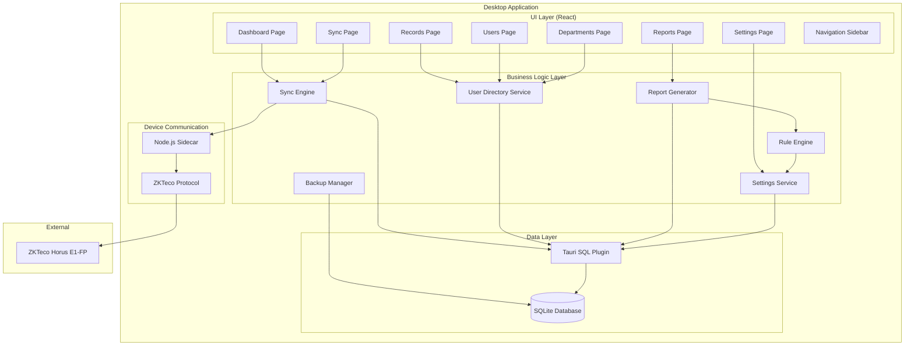
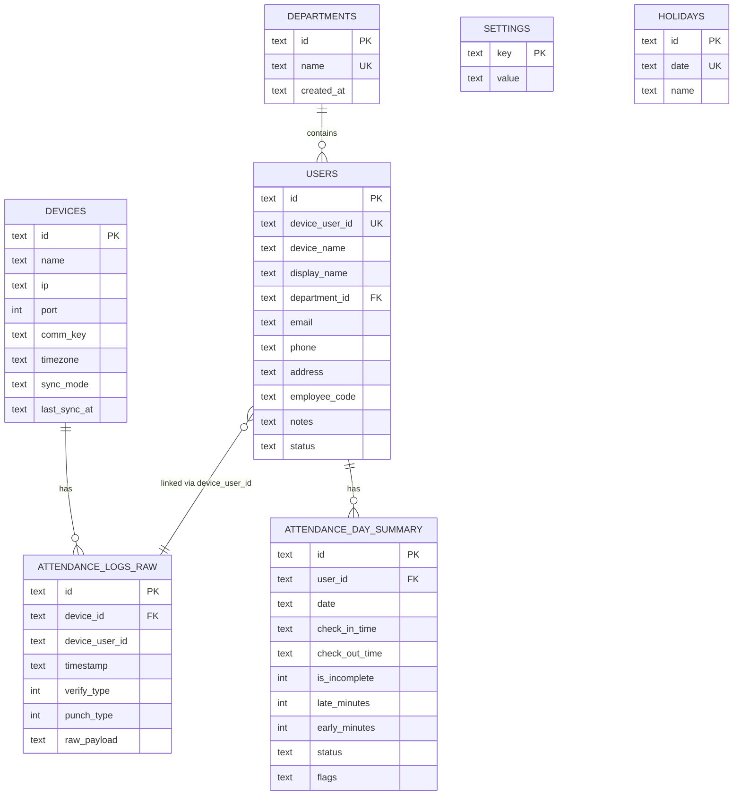

# Design Document: Horus Attendance Desktop

## Overview

Horus Attendance Desktop is a Tauri-based desktop application that provides attendance management capabilities for small to medium organizations. The application connects to ZKTeco Horus E1-FP biometric devices over the local network, synchronizes attendance data to a local SQLite database, and provides comprehensive reporting with configurable punch interpretation rules.

The architecture follows a layered approach with clear separation between the UI layer (React + Tailwind + Framer Motion), the business logic layer (TypeScript services), and the data layer (SQLite via Tauri's SQL plugin). Device communication is handled through a Node.js sidecar process that implements the ZKTeco protocol.

### Key Design Decisions

1. **Tauri over Electron**: Chosen for smaller bundle size, better performance, and native security model
2. **SQLite for local storage**: Provides reliable, file-based storage that's easy to backup and migrate
3. **Node sidecar for device communication**: Leverages existing ZKTeco Node.js libraries for faster initial development
4. **Transaction-based sync**: Ensures data integrity during sync operations with rollback on failure
5. **First/last punch interpretation**: Simplifies attendance logic while handling edge cases like single punches

## Architecture



### Component Responsibilities

| Component | Responsibility |
|-----------|----------------|
| UI Layer | React components with Tailwind styling and Framer Motion animations |
| Sync Engine | Orchestrates device communication, data transformation, and database updates |
| User Directory Service | Manages user profiles, linking, and department assignments |
| Report Generator | Produces weekly/monthly reports with attendance calculations |
| Rule Engine | Interprets punch records according to configured attendance rules |
| Backup Manager | Handles database export/import operations |
| Settings Service | Manages application configuration persistence |
| Node Sidecar | Communicates with ZKTeco devices using the proprietary protocol |

## Components and Interfaces

### Sync Engine

The Sync Engine is responsible for pulling data from ZKTeco devices and persisting it to the local database.

```typescript
interface DeviceConfig {
  id: string;
  name: string;
  ip: string;
  port: number;
  commKey: string;
  timezone: string;
  syncMode: 'auto' | 'manual';
}

interface SyncOptions {
  mode: 'latest' | 'days' | 'range';
  days?: number;
  startDate?: string;
  endDate?: string;
}

interface SyncResult {
  success: boolean;
  usersAdded: number;
  usersSynced: number;
  logsAdded: number;
  logsDeduplicated: number;
  errors: string[];
  syncedAt: string;
}

interface SyncEngine {
  testConnection(config: DeviceConfig): Promise<ConnectionTestResult>;
  syncDevice(deviceId: string, options: SyncOptions): Promise<SyncResult>;
  getDeviceInfo(config: DeviceConfig): Promise<DeviceInfo>;
  getSyncStatus(deviceId: string): Promise<SyncStatus>;
}

interface ConnectionTestResult {
  success: boolean;
  deviceInfo?: DeviceInfo;
  error?: string;
  latency: number;
}

interface DeviceInfo {
  serialNumber: string;
  firmwareVersion: string;
  userCount: number;
  logCount: number;
  lastActivity: string;
}
```

### User Directory Service

Manages user profiles and their linkage to device users.

```typescript
interface User {
  id: string;
  deviceUserId: string | null;
  deviceName: string | null;
  displayName: string;
  departmentId: string | null;
  email: string | null;
  phone: string | null;
  address: string | null;
  employeeCode: string | null;
  notes: string | null;
  status: 'active' | 'inactive';
  createdAt: string;
  updatedAt: string;
}

interface UserFilter {
  search?: string;
  departmentId?: string;
  status?: 'active' | 'inactive' | 'all';
  linkedOnly?: boolean;
}

interface UserDirectoryService {
  listUsers(filter: UserFilter): Promise<User[]>;
  getUser(id: string): Promise<User | null>;
  createUser(data: CreateUserInput): Promise<User>;
  updateUser(id: string, data: UpdateUserInput): Promise<User>;
  linkDeviceUser(userId: string, deviceUserId: string): Promise<User>;
  getUnlinkedDeviceUsers(): Promise<DeviceUser[]>;
  searchUsers(query: string): Promise<User[]>;
}

interface Department {
  id: string;
  name: string;
  createdAt: string;
  memberCount?: number;
}

interface DepartmentService {
  listDepartments(): Promise<Department[]>;
  createDepartment(name: string): Promise<Department>;
  updateDepartment(id: string, name: string): Promise<Department>;
  deleteDepartment(id: string): Promise<void>;
  getDepartmentMembers(id: string): Promise<User[]>;
}
```

### Report Generator

Produces attendance reports with configurable time ranges.

```typescript
interface WeeklyReportRow {
  user: User;
  days: DayAttendance[];
  summary: WeeklySummary;
}

interface DayAttendance {
  date: string;
  dayOfWeek: number;
  checkIn: string | null;
  checkOut: string | null;
  status: AttendanceStatus;
  lateMinutes: number;
  earlyMinutes: number;
  isIncomplete: boolean;
}

type AttendanceStatus = 'present' | 'absent' | 'late' | 'early_leave' | 'incomplete' | 'holiday' | 'weekend';

interface WeeklySummary {
  daysPresent: number;
  daysAbsent: number;
  totalLateMinutes: number;
  totalEarlyMinutes: number;
  incompleteDays: number;
}

interface MonthlyReportRow {
  user: User;
  summary: MonthlySummary;
  dailyDetails: DayAttendance[];
}

interface MonthlySummary {
  daysPresent: number;
  daysAbsent: number;
  totalLateMinutes: number;
  totalEarlyMinutes: number;
  incompleteDays: number;
  totalWorkingDays: number;
  attendancePercentage: number;
}

interface ReportFilter {
  departmentId?: string;
  userIds?: string[];
}

interface ReportGenerator {
  generateWeeklyReport(weekStart: string, filter?: ReportFilter): Promise<WeeklyReportRow[]>;
  generateMonthlyReport(year: number, month: number, filter?: ReportFilter): Promise<MonthlyReportRow[]>;
  exportToCSV(report: WeeklyReportRow[] | MonthlyReportRow[], filename: string): Promise<string>;
}
```

### Rule Engine

Interprets punch records according to configured attendance rules.

```typescript
interface AttendanceRules {
  workStartTime: string; // HH:mm format
  workEndTime: string;
  lateGracePeriod: number; // minutes
  earlyLeaveGracePeriod: number; // minutes
  checkInWindowStart: string; // HH:mm
  checkInWindowEnd: string;
  checkOutWindowStart: string;
  checkOutWindowEnd: string;
  workdays: number[]; // 0=Sunday, 1=Monday, etc.
}

interface PunchRecord {
  id: string;
  deviceId: string;
  deviceUserId: string;
  timestamp: string;
  verifyType: number;
  punchType: number;
}

interface DailySummary {
  userId: string;
  date: string;
  checkInTime: string | null;
  checkOutTime: string | null;
  isIncomplete: boolean;
  lateMinutes: number;
  earlyMinutes: number;
  status: AttendanceStatus;
  flags: string[];
}

interface RuleEngine {
  processDay(userId: string, date: string, punches: PunchRecord[]): DailySummary;
  calculateLateMinutes(checkInTime: string, rules: AttendanceRules): number;
  calculateEarlyMinutes(checkOutTime: string, rules: AttendanceRules): number;
  isWorkday(date: string, rules: AttendanceRules): boolean;
  isHoliday(date: string): Promise<boolean>;
}
```

### Backup Manager

Handles database export and import operations.

```typescript
interface BackupMetadata {
  version: string;
  createdAt: string;
  appVersion: string;
  userCount: number;
  logCount: number;
  checksum: string;
}

interface BackupResult {
  success: boolean;
  filePath: string;
  fileSize: number;
  metadata: BackupMetadata;
}

interface RestoreResult {
  success: boolean;
  usersRestored: number;
  logsRestored: number;
  error?: string;
}

interface BackupManager {
  createBackup(destinationPath?: string): Promise<BackupResult>;
  restoreBackup(filePath: string): Promise<RestoreResult>;
  validateBackup(filePath: string): Promise<BackupMetadata | null>;
  getBackupHistory(): Promise<BackupMetadata[]>;
}
```

### Settings Service

Manages application configuration.

```typescript
interface AppSettings {
  device: DeviceConfig | null;
  attendance: AttendanceRules;
  holidays: string[]; // ISO date strings
  appearance: {
    theme: 'light' | 'dark' | 'system';
  };
  backup: {
    autoBackup: boolean;
    backupPath: string;
    lastBackupAt: string | null;
  };
}

interface SettingsService {
  getSettings(): Promise<AppSettings>;
  updateSettings(settings: Partial<AppSettings>): Promise<AppSettings>;
  getSetting<K extends keyof AppSettings>(key: K): Promise<AppSettings[K]>;
  setSetting<K extends keyof AppSettings>(key: K, value: AppSettings[K]): Promise<void>;
  resetToDefaults(): Promise<AppSettings>;
}
```

## Data Models

### SQLite Schema

```sql
-- Devices table for storing ZKTeco device configurations
CREATE TABLE devices (
    id TEXT PRIMARY KEY,
    name TEXT NOT NULL,
    ip TEXT NOT NULL,
    port INTEGER NOT NULL DEFAULT 4370,
    comm_key TEXT DEFAULT '',
    timezone TEXT DEFAULT 'UTC',
    sync_mode TEXT DEFAULT 'manual' CHECK (sync_mode IN ('auto', 'manual')),
    last_sync_at TEXT,
    created_at TEXT NOT NULL DEFAULT (datetime('now')),
    updated_at TEXT NOT NULL DEFAULT (datetime('now'))
);

-- Departments table for organizational units
CREATE TABLE departments (
    id TEXT PRIMARY KEY,
    name TEXT NOT NULL UNIQUE,
    created_at TEXT NOT NULL DEFAULT (datetime('now'))
);

-- Users table with enriched profile data
CREATE TABLE users (
    id TEXT PRIMARY KEY,
    device_user_id TEXT UNIQUE,
    device_name TEXT,
    display_name TEXT NOT NULL,
    department_id TEXT REFERENCES departments(id) ON DELETE SET NULL,
    email TEXT,
    phone TEXT,
    address TEXT,
    employee_code TEXT,
    notes TEXT,
    status TEXT NOT NULL DEFAULT 'active' CHECK (status IN ('active', 'inactive')),
    created_at TEXT NOT NULL DEFAULT (datetime('now')),
    updated_at TEXT NOT NULL DEFAULT (datetime('now'))
);

-- Raw attendance logs from device
CREATE TABLE attendance_logs_raw (
    id TEXT PRIMARY KEY,
    device_id TEXT NOT NULL REFERENCES devices(id) ON DELETE CASCADE,
    device_user_id TEXT NOT NULL,
    timestamp TEXT NOT NULL,
    verify_type INTEGER,
    punch_type INTEGER,
    raw_payload TEXT,
    created_at TEXT NOT NULL DEFAULT (datetime('now')),
    UNIQUE(device_id, device_user_id, timestamp)
);

-- Daily attendance summaries (computed from raw logs)
CREATE TABLE attendance_day_summary (
    id TEXT PRIMARY KEY,
    user_id TEXT NOT NULL REFERENCES users(id) ON DELETE CASCADE,
    date TEXT NOT NULL,
    check_in_time TEXT,
    check_out_time TEXT,
    is_incomplete INTEGER NOT NULL DEFAULT 0,
    late_minutes INTEGER NOT NULL DEFAULT 0,
    early_minutes INTEGER NOT NULL DEFAULT 0,
    status TEXT NOT NULL DEFAULT 'absent',
    flags TEXT, -- JSON array of flags
    created_at TEXT NOT NULL DEFAULT (datetime('now')),
    updated_at TEXT NOT NULL DEFAULT (datetime('now')),
    UNIQUE(user_id, date)
);

-- Application settings key-value store
CREATE TABLE settings (
    key TEXT PRIMARY KEY,
    value TEXT NOT NULL,
    updated_at TEXT NOT NULL DEFAULT (datetime('now'))
);

-- Holidays table
CREATE TABLE holidays (
    id TEXT PRIMARY KEY,
    date TEXT NOT NULL UNIQUE,
    name TEXT,
    created_at TEXT NOT NULL DEFAULT (datetime('now'))
);

-- Indexes for performance
CREATE INDEX idx_users_department ON users(department_id);
CREATE INDEX idx_users_status ON users(status);
CREATE INDEX idx_users_device_user_id ON users(device_user_id);
CREATE INDEX idx_attendance_logs_timestamp ON attendance_logs_raw(timestamp);
CREATE INDEX idx_attendance_logs_device_user ON attendance_logs_raw(device_user_id);
CREATE INDEX idx_attendance_summary_date ON attendance_day_summary(date);
CREATE INDEX idx_attendance_summary_user_date ON attendance_day_summary(user_id, date);
```

### Entity Relationships




## Correctness Properties

*A property is a characteristic or behavior that should hold true across all valid executions of a system—essentially, a formal statement about what the system should do. Properties serve as the bridge between human-readable specifications and machine-verifiable correctness guarantees.*

### Property 1: Device Configuration Round-Trip

*For any* valid device configuration (name, IP, port, comm_key, timezone, sync_mode), saving it to the database and then retrieving it should return an equivalent configuration object.

**Validates: Requirements 1.4, 1.5**

### Property 2: Attendance Log Deduplication

*For any* set of attendance log records, inserting the same record (same device_id, device_user_id, timestamp) multiple times should result in exactly one record in the database.

**Validates: Requirements 2.2**

### Property 3: Transaction Rollback on Sync Failure

*For any* sync operation that fails mid-way, the database state after the failure should be identical to the state before the sync started (no partial data).

**Validates: Requirements 2.5**

### Property 4: User Profile CRUD and Linking

*For any* device user synced from a device, a corresponding user profile should be created with the device_user_id linked. *For any* user profile update, the updated fields should persist correctly when retrieved.

**Validates: Requirements 3.2, 3.3, 3.5**

### Property 5: User Search Filtering

*For any* search query (by name, department, or employee code), all returned users should match the search criteria, and no matching users should be excluded from results.

**Validates: Requirements 3.4**

### Property 6: Inactive User Exclusion

*For any* user marked as inactive, that user should not appear in active attendance tracking queries or active user counts.

**Validates: Requirements 3.6**

### Property 7: Department CRUD with Member Counts

*For any* department, the member count should equal the number of users with that department_id. *For any* department name, creating a department with a duplicate name should be rejected.

**Validates: Requirements 4.1, 4.2, 4.3**

### Property 8: Department Deletion User Handling

*For any* department that is deleted, all users previously in that department should have their department_id set to null.

**Validates: Requirements 4.4**

### Property 9: Attendance Record Filtering

*For any* filter criteria (date range, user, department, punch type), all returned attendance records should match all specified criteria.

**Validates: Requirements 5.2**

### Property 10: Attendance Record Sorting

*For any* sort order (by timestamp, user, or department), the returned attendance records should be in the correct ascending or descending order according to the specified field.

**Validates: Requirements 5.5**

### Property 11: Date Range Query Completeness

*For any* date range query (week, month, or custom), the returned daily summaries should include exactly one entry for each day in the specified range, with no gaps or duplicates.

**Validates: Requirements 6.1, 6.3, 6.4, 6.5**

### Property 12: Attendance Status Derivation

*For any* daily attendance record, the status (present, absent, late, early_leave, incomplete) should be correctly derived from the check-in time, check-out time, and configured rules.

**Validates: Requirements 7.2**

### Property 13: Report Department Filtering

*For any* report filtered by department, all users in the report should belong to the specified department, and no users from other departments should be included.

**Validates: Requirements 7.4, 8.5**

### Property 14: Weekly Summary Calculation

*For any* weekly report, the weekly totals (days present, days absent, total late minutes) should equal the sum of the corresponding daily values for that week.

**Validates: Requirements 7.5**

### Property 15: Monthly Summary Calculation

*For any* monthly report, the monthly totals (days present, days absent, total late minutes, total early minutes, incomplete days) should equal the sum of the corresponding daily values for that month.

**Validates: Requirements 8.2**

### Property 16: Report CSV Export Round-Trip

*For any* report (weekly or monthly), exporting to CSV and parsing the CSV should produce data equivalent to the original report data.

**Validates: Requirements 7.3, 8.4**

### Property 17: First/Last Punch Rule

*For any* day with multiple punch records for a user, the check-in time should equal the timestamp of the first punch, and the check-out time should equal the timestamp of the last punch.

**Validates: Requirements 9.3**

### Property 18: Single Punch Incomplete Marking

*For any* day with exactly one punch record for a user, the day should be marked as incomplete (is_incomplete = true).

**Validates: Requirements 9.4**

### Property 19: Late Minutes Calculation

*For any* check-in time after (work_start_time + grace_period), the late_minutes should equal the difference in minutes between check-in time and (work_start_time + grace_period). *For any* check-in time at or before (work_start_time + grace_period), late_minutes should be zero.

**Validates: Requirements 9.5**

### Property 20: Early Leave Minutes Calculation

*For any* check-out time before (work_end_time - grace_period), the early_minutes should equal the difference in minutes between (work_end_time - grace_period) and check-out time. *For any* check-out time at or after (work_end_time - grace_period), early_minutes should be zero.

**Validates: Requirements 9.6**

### Property 21: Punch Window Filtering

*For any* punch record with timestamp outside the configured check-in or check-out windows, that punch should be excluded from attendance calculations.

**Validates: Requirements 9.7**

### Property 22: Backup and Restore Round-Trip

*For any* database state, creating a backup and then restoring from that backup should result in a database state equivalent to the original (same users, departments, attendance logs, settings).

**Validates: Requirements 10.1, 10.2**

### Property 23: Backup Validation

*For any* corrupted or invalid backup file, the restore operation should fail with an error and leave the existing database unchanged.

**Validates: Requirements 10.3, 10.4**

### Property 24: Settings Persistence

*For any* settings update (attendance rules, work schedule, grace periods), the updated values should persist correctly and be retrievable after application restart.

**Validates: Requirements 9.1, 9.2, 11.2**

### Property 25: Holiday Exclusion from Working Days

*For any* date configured as a holiday, that date should be excluded from working day calculations and should not count as absent.

**Validates: Requirements 11.3**

### Property 26: Dashboard Statistics Accuracy

*For any* day, the dashboard statistics (users checked in, users not checked in) should accurately reflect the attendance_day_summary data for active users.

**Validates: Requirements 12.1, 12.2**

## Error Handling

### Device Communication Errors

| Error Type | Handling Strategy |
|------------|-------------------|
| Connection timeout | Display timeout error with retry option; suggest checking IP/port |
| Authentication failure | Display auth error; prompt to verify comm_key |
| Device unreachable | Display network error; suggest checking Wi-Fi/LAN connection |
| Protocol error | Log detailed error; display generic "device communication failed" |

### Database Errors

| Error Type | Handling Strategy |
|------------|-------------------|
| Constraint violation | Catch and display user-friendly message (e.g., "Department name already exists") |
| Transaction failure | Rollback and display error; log details for debugging |
| Database corruption | Detect on startup; prompt for restore from backup |
| Disk full | Display storage error; suggest cleanup or backup location change |

### Sync Errors

| Error Type | Handling Strategy |
|------------|-------------------|
| Partial sync failure | Rollback entire transaction; display error with details |
| Duplicate detection | Silently skip duplicates; report count in sync summary |
| Invalid data from device | Log warning; skip invalid records; continue sync |

### Backup/Restore Errors

| Error Type | Handling Strategy |
|------------|-------------------|
| Invalid backup file | Validate before restore; display specific validation error |
| Corrupted backup | Detect via checksum; abort restore; display corruption error |
| Insufficient permissions | Display permission error; suggest alternative location |
| Restore failure | Rollback to pre-restore state; display error |

### Input Validation

All user inputs are validated before processing:
- IP addresses: Valid IPv4 format
- Port numbers: 1-65535 range
- Email addresses: Valid email format (optional field)
- Dates: Valid ISO date format
- Times: Valid HH:mm format
- Required fields: Non-empty validation

## Testing Strategy

### Unit Testing

Unit tests focus on specific examples, edge cases, and error conditions:

- **Rule Engine**: Test specific scenarios for late/early calculations, single punch handling, edge cases around grace periods
- **Data Transformations**: Test mapping between device data and app models
- **Validation Functions**: Test input validation with valid and invalid inputs
- **Date/Time Utilities**: Test date range calculations, week/month boundaries

### Property-Based Testing

Property-based tests validate universal properties across randomly generated inputs. Each property test runs a minimum of 100 iterations.

**Testing Library**: fast-check (TypeScript property-based testing library)

**Property Test Configuration**:
- Minimum 100 iterations per property
- Each test tagged with: `Feature: horus-attendance-desktop, Property {N}: {property_text}`

**Key Property Tests**:

1. **Data Layer Properties**:
   - Device config round-trip (Property 1)
   - Attendance log deduplication (Property 2)
   - User profile CRUD (Property 4)
   - Department CRUD with counts (Property 7)

2. **Rule Engine Properties**:
   - First/last punch rule (Property 17)
   - Single punch incomplete marking (Property 18)
   - Late minutes calculation (Property 19)
   - Early leave minutes calculation (Property 20)
   - Punch window filtering (Property 21)

3. **Report Generator Properties**:
   - Weekly summary calculation (Property 14)
   - Monthly summary calculation (Property 15)
   - CSV export round-trip (Property 16)
   - Department filtering (Property 13)

4. **Backup Manager Properties**:
   - Backup/restore round-trip (Property 22)
   - Backup validation (Property 23)

### Integration Testing

Integration tests verify component interactions:

- **Sync Flow**: Device connection → data pull → database storage → UI update
- **Report Generation**: Data query → rule application → summary calculation → export
- **Backup/Restore**: Export → file creation → import → data verification

### Test Data Generation

For property-based tests, generators produce:

- Random device configurations with valid IP/port combinations
- Random user profiles with various field combinations
- Random attendance logs with realistic timestamps
- Random date ranges for report testing
- Random attendance rules with valid time configurations

### Test Coverage Goals

- Unit tests: 80% code coverage for business logic
- Property tests: All 26 correctness properties covered
- Integration tests: All critical user flows covered
